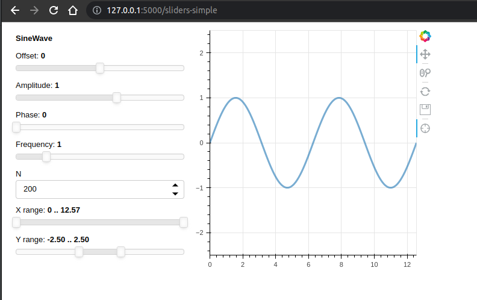

# FastAPI Panel data-app example

A minimal example of a data visualization app with FastAPI and Panel.
See also Fastapi integration section: https://panel.holoviz.org/user_guide/FastAPI.html

- Clone repo:
```shell
$ git clone https://github.com/srmds/fastapi-panel-data-app
```

- Create and activate virtual env:

```shell
$ cd fastapi-panel-data-app
$ python -m venv .venv  && source .venv/bin/activate
```
- Install dependencies

```shell
$ python -m pip install --upgrade pip
$ pip install -r requirements.txt
```

- Allow BOKEH_WS_ORIGIN

```shell
$ export BOKEH_ALLOW_WS_ORIGIN=127.0.0.1:5000
```

- Export credentials

```shell
$ export SECRET=$(uuidgen)
$ export USER=test.e@mail.com
$ export PASS=$(uuidgen)
```

- Run API:

```shell
$ uvicorn main:app --reload
````

- Open panel homepage: http://127.0.0.1:5000 


or the custom homepage: http://127.0.0.1:8000


- Click on the Sine wave app or go to: http://127.0.0.1:5000/sine to see a slider app



- Click on Maps or go to: http://127.0.0.1:5000/maps to see a Google Maps app


